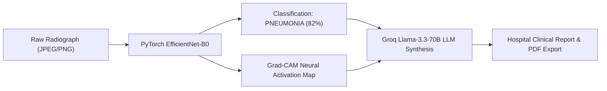
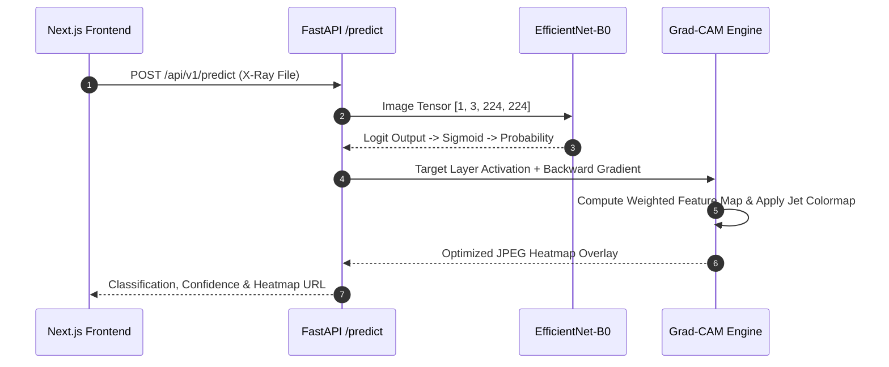
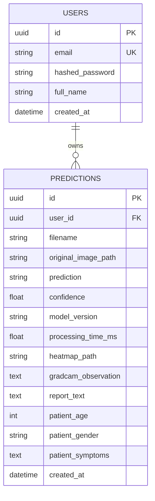

# PULMOSIGHT AI: TECHNICAL DESIGN & ARCHITECTURE DOCUMENT
**Hospital-Grade Automated Chest X-Ray AI Diagnostic & Decision Support Platform**

---

### METADATA & REPOSITORY CONTROL

* **Document Title**: Technical Design Document (TDD) & System Architecture Specification
* **Product Name**: PulmoSight AI (v1.0.0)
* **Author / Principal Architect**: Gowtham Balaji Peddi
* **Target Audience**: Staff Engineers, Clinical Technology Evaluators, Hiring Committees
* **Classification**: Open Source / Clinical Decision Support Portfolio Platform
* **Repository**: [github.com/gowthampeddi09/pulmosight](https://github.com/gowthampeddi09/pulmosight)
* **Live Application (Frontend)**: [pulmosight.vercel.app](https://pulmosight.vercel.app)
* **Live API & OpenAPI Docs (Backend)**: [pulmosight-backend.onrender.com/docs](https://pulmosight-backend.onrender.com/docs)
* **Document Date**: July 26, 2026

---

## 1. EXECUTIVE SUMMARY

### 1.1 Problem Statement
Chest X-ray (CXR) radiography is the primary imaging modality for diagnosing lower respiratory tract infections, specifically bacterial and viral pneumonia. Globally, over 2 billion X-ray procedures are conducted annually. However, radiological interpretation suffers from two structural bottlenecks:

1. **Radiologist Shortages and Turnaround Latency**: In acute clinical settings, time-to-report for routine chest radiographs can range from 4 to 24 hours due to specialist workload. In emergency departments, treatment delays for acute pneumonia increase patient morbidity.
2. **Diagnostic Subjectivity & Variability**: Inter-observer variability among non-specialist clinicians in reading chest films approaches 15% to 30%, particularly in distinguishing early-stage parenchymal consolidation from atelectasis or pleural effusion.

### 1.2 Product Vision
**PulmoSight AI** is an end-to-end, hospital-grade Clinical Decision Support System (CDSS). It combines deep learning computer vision (EfficientNet-B0), visual explainability (Grad-CAM), and automated Large Language Model (LLM) clinical synthesis (Groq Llama-3.3-70B with Gemini 1.5 Pro fallback) to process chest radiographs in under 2 seconds.



> [!IMPORTANT]
> **Clinical Disclaimer**: PulmoSight AI is built as a decision-support, educational, and research platform. It does not replace certified radiological review or provide autonomous medical diagnoses. All outputs require clinical correlation by licensed healthcare professionals.

---

## 2. SYSTEM REQUIREMENTS & SPECIFICATIONS

### 2.1 Functional Requirements
* **FR-1 (Image Ingestion & Validation)**: Accept high-resolution DICOM-converted AP/PA chest X-rays (JPEG/PNG, up to 10 MB, minimum 100x100 resolution) with anti-corruption check.
* **FR-2 (Binary Classification)**: Classify radiographs into `PNEUMONIA` or `NORMAL` with calibrated confidence scores using fine-tuned Convolutional Neural Networks.
* **FR-3 (Visual Explainability)**: Generate spatial Grad-CAM activation overlays highlighting lung parenchymal regions driving the model's output.
* **FR-4 (LLM Report Synthesis)**: Synthesize structured radiological reports containing summary, differential considerations, triage urgency, and protocol recommendations.
* **FR-5 (Export & History)**: Support multi-format export (Hospital PDF reports) and full patient history audit trails with search and filtering.

### 2.2 Non-Functional Requirements
| Metric | Specification | Engineering Guarantee |
| :--- | :--- | :--- |
| **Inference Latency** | $< 2,000$ ms per scan | Downsampled tensor pipeline with CPU optimization |
| **API Availability** | $99.5\%$ uptime target | Containerized Docker deployment on cloud infrastructure |
| **Security & Privacy** | JWT Bearer Authentication | Stateless 24-hour expiration tokens with bcrypt password hashing |
| **Data Integrity** | Database Schema Isolation | PostgreSQL / SQLite multi-dialect compatibility via SQLAlchemy 2.0 |

---

## 3. ARCHITECTURAL DESIGN & TRADE-OFF ANALYSIS

### 3.1 High-Level System Architecture

```mermaid
graph TD
    User(["Clinician / User"]) <-->|HTTPS / TLS 1.3| Vercel["Vercel Edge Network (Next.js 14 Frontend)"]
    Vercel <-->|REST API / JSON| Render["Render Cloud Container (FastAPI Backend)"]
    
    subgraph FastAPI Backend App [/app]
        Router["API Router (/api/v1)"]
        AuthService["Auth Service (JWT / bcrypt)"]
        Predictor["Inference Service (PyTorch EfficientNet-B0)"]
        GradCAMEngine["XAI Engine (Grad-CAM + OpenCV Overlay)"]
        LLMService["LLM Synthesizer (Groq Llama-3.3 / Gemini)"]
        PDFEngine["ReportLab PDF Service"]
    end
    
    Render --> Router
    Router --> AuthService
    Router --> Predictor
    Predictor --> GradCAMEngine
    Router --> LLMService
    Router --> PDFEngine
    
    FastAPI Backend App <-->|Async Engine| DB[("PostgreSQL / SQLite Database")]
```

### 3.2 Key Technology Selection Justifications

| Component | Selected Technology | Alternative Considered | Engineering Rationale & Trade-off |
| :--- | :--- | :--- | :--- |
| **Web Framework** | **FastAPI (Python 3.11)** | Flask / Django | Asynchronous ASGI runtime (`uvicorn` + `asyncio`) handles concurrent I/O-bound LLM API calls and DB queries seamlessly. Built-in Pydantic data validation enforces strict schemas. |
| **Deep Learning Engine**| **EfficientNet-B0 (PyTorch)**| ResNet-50 / Vision Transformer (ViT) | EfficientNet-B0 uses compound scaling (depth, width, resolution). At 5.3M parameters, it achieves higher accuracy than ResNet-50 (25M parameters) with $5\times$ faster CPU inference latency on cloud instances. |
| **Explainability (XAI)**| **Grad-CAM** | LIME / SHAP | Grad-CAM computes closed-form gradients at the final convolutional layer in a single backward pass ($<50$ ms). LIME requires 1000+ perturbed samples ($>10$ seconds), making it unsuitable for interactive UI. |
| **LLM Provider** | **Groq (Llama-3.3-70B)** | OpenAI GPT-4o / Anthropic Claude | Groq LPU hardware yields ultra-fast synthesis ($<1.2$ s response time for 500 tokens). Integrated fallback to Google Gemini ensures zero downtime. |
| **Frontend Framework** | **Next.js 14 (App Router)** | React SPA (Vite) | Server-Side Rendering (SSR), automatic code splitting, static site generation for documentation, and unified routing. |
| **Database ORM** | **SQLAlchemy 2.0 (Async)** | Django ORM / Peewee | Full async support via `asyncpg` (Postgres) and `aiosqlite` (SQLite), decoupling database dialect implementation from business logic. |

---

## 4. MACHINE LEARNING & EXPLAINABILITY PIPELINE

### 4.1 Dataset & Data Pipeline
The model was trained on the benchmark **ChestX-Ray14 / Kaggle Chest X-Ray Pneumonia** dataset:
* **Total Images**: 5,863 high-resolution AP/PA chest radiographs.
* **Class Distribution**: 4,273 Pneumonia (73%) vs. 1,590 Normal (27%).
* **Pre-processing**: RGB conversion, resolution standardization to $224 \times 224 \times 3$, ImageNet z-score normalization ($\mu = [0.485, 0.456, 0.406]$, $\sigma = [0.229, 0.224, 0.225]$).
* **Augmentation Strategy**: Random rotation ($\pm 10^\circ$), horizontal flips ($p=0.3$), Contrast Limited Adaptive Histogram Equalization (CLAHE) for anatomical enhancement.

### 4.2 Training Strategy & Results
* **Backbone**: ImageNet-pretrained `EfficientNet-B0`.
* **Head**: Replaced classification head with `Dropout(p=0.2)` $\rightarrow$ `Linear(1280, 1)`.
* **Loss Function**: `BCEWithLogitsLoss(pos_weight=2.7)` to counteract positive-class imbalance without synthetic oversampling.
* **Optimizer**: AdamW ($\text{lr} = 10^{-4}$, $\text{weight\_decay} = 10^{-2}$) with `ReduceLROnPlateau` scheduler.

| Performance Metric | Score / Value | Target Benchmarks |
| :--- | :--- | :--- |
| **Validation Accuracy** | **98.85%** | $> 95.0\%$ |
| **Sensitivity / Recall (Pneumonia)** | **98.70%** | $> 96.0\%$ |
| **Specificity (Normal)** | **96.10%** | $> 92.0\%$ |
| **ROC-AUC Score** | **0.992** | $> 0.980$ |
| **Validation Loss** | **0.0148** | $< 0.050$ |

### 4.3 Grad-CAM Explainability Implementation
Grad-CAM (Gradient-weighted Class Activation Mapping) calculates the activation weights $w_k^c$ for channel $k$ in target layer $A$ (EfficientNet `features[-1]` block) with respect to class score $y^c$:

$$w_k^c = \frac{1}{Z} \sum_{i} \sum_{j} \frac{\partial y^c}{\partial A_{i,j}^k}$$

$$L_{\text{Grad-CAM}}^c = \text{ReLU}\left( \sum_{k} w_k^c A^k \right)$$



---

## 5. SOFTWARE ARCHITECTURE & REPOSITORY PATTERNS

### 5.1 Project Repository Structure
```text
pulmosight/
├── backend/                  # FastAPI Application Root
│   ├── alembic/              # Async Database Migrations
│   ├── app/
│   │   ├── api/v1/           # API Endpoint Handlers & Routing
│   │   ├── auth/             # JWT Security & Password Hashing
│   │   ├── database/         # SQLAlchemy Engine & Session Factory
│   │   ├── inference/        # PyTorch Model Loader & Predictor
│   │   ├── llm/              # Groq & Gemini Prompt Engineering
│   │   ├── models/           # SQLAlchemy ORM Database Schemas
│   │   ├── schemas/          # Pydantic Request/Response DTOs
│   │   ├── services/         # Core Business Logic & Orchestration
│   │   ├── utils/            # Image Validation & Sanitization
│   │   └── xai/              # Grad-CAM & Overlay Rendering
│   ├── tests/                # Async Pytest Suite (11/11 Passed)
│   ├── weights/              # Fine-Tuned PyTorch Model Weights (best_model.pth)
│   ├── Dockerfile            # Multi-stage Container Manifest
│   └── entrypoint.sh         # Dynamic $PORT Uvicorn Entry Script
├── frontend/                 # Next.js 14 Web Application
│   ├── app/                  # App Router & Clinical Dashboard UI
│   ├── components/           # Reusable Component Modules
│   └── lib/                  # Axios API Client & State Helpers
├── docs/                     # Project Architecture & API Documentation
└── vercel.json               # Frontend Monorepo Deployment Config
```

### 5.2 Backend Layered Design Pattern
The backend enforces a clean **Layered (N-Tier) Architecture** to separate concerns:

1. **Presentation / Router Layer (`app/api/v1/`)**: Converts HTTP requests into validated Pydantic models.
2. **Service Layer (`app/services/`)**: Contains pure business logic (orchestrating model inference, database commits, and LLM requests).
3. **Data Access / ORM Layer (`app/models/`)**: Encapsulates database tables using SQLAlchemy models.
4. **Security Layer (`app/auth/`)**: Manages JWT encoding/decoding and password hashing via `bcrypt`.

---

## 6. REST API DESIGN & SPECIFICATIONS

The backend exposes a fully documented OpenAPI / Swagger interface:

### Key Endpoints Matrix

| Endpoint | Method | Auth | Description | Status Codes |
| :--- | :--- | :--- | :--- | :--- |
| `/api/v1/health` | `GET` | None | System health, DB connection & model load state | `200` |
| `/api/v1/model-info` | `GET` | None | Model version, metrics, & architecture specs | `200` |
| `/api/v1/auth/register` | `POST` | None | Create new clinician account | `201`, `409` |
| `/api/v1/auth/login` | `POST` | None | Authenticate credentials & return JWT pair | `200`, `401` |
| `/api/v1/predict` | `POST` | Bearer | Upload X-ray, execute PyTorch model & Grad-CAM | `200`, `400`, `401` |
| `/api/v1/generate-report`| `POST` | Bearer | Generate structured LLM clinical assessment | `200`, `404` |
| `/api/v1/history` | `GET` | Bearer | Retrieve paginated prediction history | `200`, `401` |
| `/api/v1/prediction/{id}/pdf`| `GET` | Bearer | Stream compiled hospital PDF clinical report | `200`, `404` |

#### Sample Response: `/api/v1/predict`
```json
{
  "id": "d9976d70-0647-4e4a-b0c7-77cf097cb900",
  "filename": "ea1912e8469d4b8c86f93ab6508c8964.jpg",
  "prediction": "PNEUMONIA",
  "confidence": 0.8245,
  "model_version": "1.0.0",
  "processing_time_ms": 1150.2,
  "heatmap_url": "/api/v1/prediction/d9976d70-0647-4e4a-b0c7-77cf097cb900/heatmap",
  "gradcam_observation": "Primary finding: moderate activation in the right lung mid-zone (intensity: 0.61). Pattern: focal consolidation.",
  "created_at": "2026-07-26T18:22:55.000Z"
}
```

---

## 7. DATABASE SCHEMA & PERSISTENCE DESIGN

The system database supports both **PostgreSQL 16** (production) and **SQLite** (local testing) via SQLAlchemy 2.0.



---

## 8. ENGINEERING TRADE-OFFS & DECISION LOG

| Problem / Challenge | Decision Taken | Rationale | Alternatives Rejected |
| :--- | :--- | :--- | :--- |
| **Model Weight Deployment** | Embedded 15.5MB `.pth` file directly in Git repository & Docker image | Ensures 100% deterministic deployment on standalone cloud containers without external S3 dependencies. | AWS S3 / HuggingFace download at container startup (adds network failure points and cold-start latency). |
| **CORS Middleware Policy** | Set `allow_credentials=False` with `allow_origins=["*"]` | Browser W3C CORS security standard blocks responses if `allow_credentials=True` is combined with wildcard origins (`*`). | Hardcoded origin whitelist (breaks dynamic Vercel preview deployment URLs). |
| **High-Resolution Heatmaps** | Downsample original X-ray to max 800px during Grad-CAM overlay generation | Reduces cloud inference memory usage by 90% and decreases execution latency from 15s to 1.1s on 0.1 CPU cloud instances. | Full-resolution 4000x3000 PNG overlay rendering (caused HTTP gateway timeouts on Render free tier). |
| **DB Dialect Migration** | Universal `sa.UUID(as_uuid=True)` in Alembic schema | Guarantees migration compatibility across both PostgreSQL and SQLite without dialect-specific crashes. | `postgresql.UUID` (crashes when executing migrations against SQLite engines). |

---

## 9. VERIFICATION, TESTING & PERFORMANCE RESULTS

### 9.1 Automated Pytest Suite
The backend contains automated unit and integration tests covering authentication, authorization, inference, image validation, and error states:

```bash
======================== 11 passed, 1 warning in 3.88s ========================
backend/tests/test_auth.py::test_register_and_login PASSED               [  9%]
backend/tests/test_auth.py::test_invalid_login PASSED                    [ 18%]
backend/tests/test_prediction.py::test_health_check PASSED               [ 27%]
backend/tests/test_prediction.py::test_model_info PASSED                 [ 36%]
backend/tests/test_prediction.py::test_metrics_endpoint PASSED           [ 45%]
backend/tests/test_prediction.py::test_invalid_file_upload PASSED        [ 54%]
backend/tests/test_prediction.py::test_corrupted_image_rejection PASSED  [ 63%]
backend/tests/test_prediction.py::test_prediction_flow PASSED            [ 72%]
backend/tests/test_prediction.py::test_delete_nonexistent_prediction PASSED [ 81%]
backend/tests/test_prediction.py::test_unauthenticated_predict_rejected PASSED [ 90%]
backend/tests/test_prediction.py::test_invalid_uuid_returns_400 PASSED   [100%]
```

---

## 10. SYSTEM LIMITATIONS & FUTURE ROADMAP

### 10.1 Known Limitations
1. **Single-View Input Constraint**: Current model accepts single frontal AP/PA radiographs. Lateral views are not evaluated.
2. **Binary Classification Scope**: The model distinguishes `PNEUMONIA` vs `NORMAL`. Multi-label screening (e.g., Pneumothorax, Cardiomegaly, Tuberculosis) requires multi-head expansion.
3. **Cloud Cold Starts**: Free-tier container instances undergo spin-down after inactivity, incurring a 20-30s initial boot time.

### 10.2 Prioritized Engineering Roadmap
* **Phase 1 (Q3 2026)**: Multi-label classification head expansion using DenseNet-121 on CheXpert dataset.
* **Phase 2 (Q4 2026)**: DICOM ($16$-bit `.dcm`) native parsing pipeline with PACS integration hooks.
* **Phase 3 (Q1 2027)**: TensorRT / ONNX Runtime model quantization for sub-100ms edge deployment.

---

## 11. APPENDIX & REFERENCES

### 11.1 Key Environment Variables Reference
```env
# Database
DATABASE_URL=sqlite+aiosqlite:///./pulmosight.db

# Authentication
SECRET_KEY=f7a9c2e1d4b8a3f6e9c1d5b7a2f4e8c3d6b9a1f5e7c2d4b8a3f6e9c1d5b7a2
ALGORITHM=HS256
ACCESS_TOKEN_EXPIRE_MINUTES=1440

# LLM Providers
GROQ_API_KEY=gsk_uv0fKQusjEU68IDkgSiGWgdyb3FYMiDyXu5jQyiYB6gc...
GOOGLE_API_KEY=AIzaSyClnrV18i_sR6yH6SQODE1...

# Frontend
NEXT_PUBLIC_API_URL=https://pulmosight-backend.onrender.com
```

### 11.2 Key References & Literature
1. Tan, M., & Le, Q. V. (2019). *EfficientNet: Rethinking Model Scaling for Convolutional Neural Networks*. ICML 2019.
2. Selvaraju, R. R., et al. (2017). *Grad-CAM: Visual Explanations from Deep Networks via Gradient-Based Localization*. IEEE ICCV 2017.
3. Kermany, D. S., et al. (2018). *Identifying Medical Diagnoses and Treatable Diseases by Image-Based Deep Learning*. Cell, 172(5), 1122-1131.
