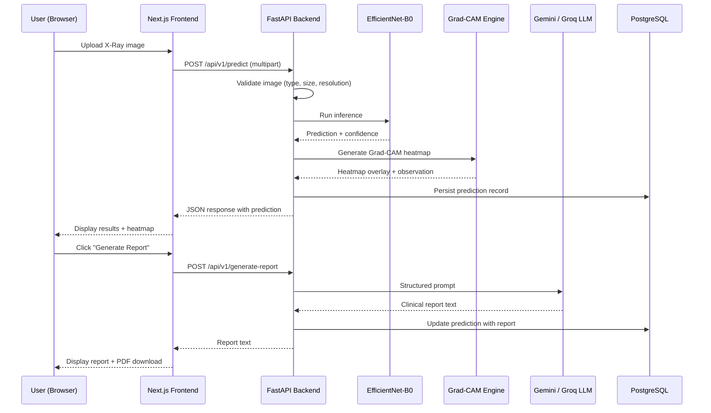

# PulmoSight System Architecture

## Layered Architecture

PulmoSight enforces a strict layered architecture: **Routes → Service Layer → Inference Engine / LLM Client / DB Repository**.

```
┌───────────────────────────────────────────────────────────────────────────┐
│                           Next.js Frontend                               │
│                    (React 18 / TypeScript / Tailwind CSS)                │
└───────────────────────────────┬───────────────────────────────────────────┘
                                │ HTTP / REST (JWT Bearer Auth)
                                ▼
┌───────────────────────────────────────────────────────────────────────────┐
│                            FastAPI Backend                               │
│                                                                          │
│  ┌──────────────────┐    ┌─────────────────┐    ┌──────────────────────┐ │
│  │  API Controllers │ →  │  Service Layer  │ →  │ PyTorch EfficientNet │ │
│  │ (Thin validation)│    │ (Orchestration) │    │  Inference Engine    │ │
│  └──────────────────┘    └────────┬────────┘    └──────────────────────┘ │
│                                   │                                      │
│                                   ├─→ Grad-CAM Heatmap Engine            │
│                                   ├─→ Google Gemini / Groq LLM Client    │
│                                   └─→ ReportLab PDF Generator            │
│                                                                          │
└───────────────────────────────────┬──────────────────────────────────────┘
                                    │
                                    ▼
                          ┌────────────────────┐
                          │ PostgreSQL Database │
                          │  (Users & History)  │
                          └────────────────────┘
```

## Design Principles

1. **Thin Controllers**: Route handlers contain no business logic — only request validation, calling the service layer, and shaping the HTTP response.
2. **Service Layer Orchestration**: The service layer orchestrates: validate image → run inference → run Grad-CAM → call LLM → persist to DB → return result.
3. **Dependency Injection**: Database sessions are injected via FastAPI `Depends()`, never imported directly into route handlers.
4. **Graceful Degradation**: If LLM providers fail, the system returns a structured fallback report. If Grad-CAM fails, prediction still succeeds with a logged warning.

## Data Flow



## Security

- **JWT Authentication**: Access tokens (15-min) + refresh tokens (7-day) with bcrypt password hashing.
- **Input Validation**: Pydantic v2 schemas validate all request bodies. Image validation rejects non-image files, corrupted images, and low-resolution images.
- **No PHI Storage**: Patient age/gender/symptoms are optional LLM context fields, NOT real Protected Health Information.

## Deployment

Three-container Docker Compose stack:
- **postgres**: PostgreSQL 16 Alpine with persistent volume
- **backend**: Python 3.11 Slim with CPU-only PyTorch
- **frontend**: Node.js 20 Alpine running Next.js dev server
